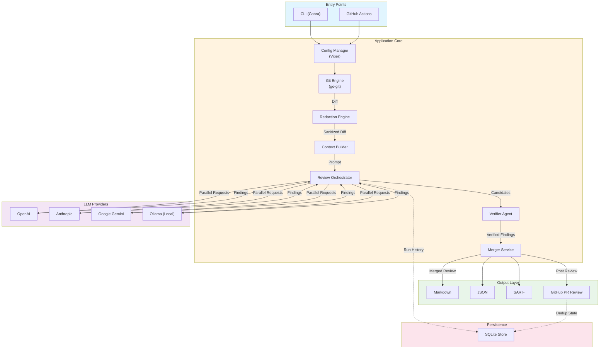

# Code Reviewer (cr)

AI-powered code review tool that uses multiple LLM providers to analyze Git branches and generate detailed review feedback. Operates as a **first-class GitHub reviewer** with inline annotations and configurable blocking behavior, or as a **local CLI tool** for standalone reviews.

## ⚠️ Security Warning

**This tool sends your code to third-party LLM APIs.**

Before using this tool, especially in CI/CD or on private repositories, please read [docs/SECURITY.md](docs/SECURITY.md) for:
- Data transmission and privacy implications
- Secret redaction capabilities and limitations
- LLM provider data retention policies
- Security best practices and recommendations
- Compliance considerations (GDPR, HIPAA, etc.)

**TL;DR Security Recommendations:**
- ✅ **Public repos**: Generally safe for open-source projects
- ⚠️ **Private repos**: Use enterprise LLM tiers with data protection OR local Ollama models
- ❌ **Never commit secrets**: Tool has regex-based redaction but cannot catch everything
- 📋 **Review provider policies**: Understand how your code will be stored and used

See [Security Considerations](docs/SECURITY.md) for complete details.

## Architecture



### Data Flow

1. **Entry** → User invokes via CLI or GitHub Actions triggers on PR
2. **Configuration** → Viper loads layered config (files, env vars, flags)
3. **Git Analysis** → go-git produces cumulative diff between base and target refs
4. **Redaction** → Secrets are stripped via regex patterns before LLM transmission
5. **Context Assembly** → Prompt builder combines diff, docs, and custom instructions
6. **Parallel Review** → Orchestrator dispatches to configured LLM providers concurrently
7. **Verification** → Agent-based verification filters false positives (optional)
8. **Merge & Dedupe** → Multi-provider findings are synthesized; duplicates are filtered
9. **Output** → Reviews written to disk (Markdown, JSON, SARIF) and/or posted to GitHub

## Features

### GitHub PR Integration (Primary Mode)
- **Inline Annotations** — Comments on specific source lines, not just PR comments
- **First-Class Reviewer** — Initiates actual GitHub code reviews via the Review API
- **Request Changes** — Configurable blocking behavior per severity level
- **Skip Triggers** — Bypass reviews with `[skip code-review]` in head commit, PR title, or description
- **Finding Deduplication** — Track findings across PR updates, don't re-flag same issues
- **Semantic Deduplication** — LLM-based detection of similar findings across review cycles
- **Status-Aware Reviews** — Detect acknowledged/disputed replies for accurate review status
- **Stale Review Dismissal** — Auto-dismiss previous bot reviews on new push
- **PR Size Guards** — Warn and gracefully handle PRs exceeding context limits

### Local CLI (Secondary Mode)
- **Multi-Provider Support** — OpenAI, Anthropic Claude, Google Gemini, and local Ollama models
- **Git Integration** — Review branches, commits, and diffs directly from your repository
- **Interactive Planning** — LLM-powered clarifying questions before review for better context
- **Multiple Output Formats** — Markdown, JSON, and SARIF for CI/CD integration
- **Agent-Based Verification** — Filter false positives with confidence thresholds

### Core Capabilities
- **Cost Tracking** — Automatic token counting and cost calculation per provider
- **Observability** — Comprehensive logging and metrics for monitoring API usage
- **Review History** — SQLite-based storage for tracking reviews over time
- **Secret Protection** — Automatic redaction to prevent secrets from being sent to LLMs
- **Deterministic Reviews** — Reproducible results for CI/CD pipelines
- **Merge Strategies** — Combine insights from multiple providers with configurable weights

## Quick Start

### Installation

```bash
# Clone the repository
git clone https://github.com/bkyoung/code-reviewer
cd code-reviewer

# Build the tool
go build -o cr ./cmd/cr

# Verify installation
./cr --version
```

### Configuration

1. Create a configuration file:

```bash
mkdir -p ~/.config/cr
cat > ~/.config/cr/cr.yaml << 'EOF'
providers:
  openai:
    enabled: true
    model: "gpt-4o-mini"
    apiKey: "${OPENAI_API_KEY}"

output:
  directory: "./reviews"

observability:
  logging:
    enabled: true
    level: "info"
    format: "human"
    redactAPIKeys: true
  metrics:
    enabled: true
EOF
```

2. Set your API key:

```bash
export OPENAI_API_KEY="sk-your-api-key-here"
```

### Basic Usage

```bash
# Review the current branch against main
./cr review branch main

# Review with custom context
./cr review branch main --instructions "Focus on security"

# Interactive mode with planning questions
./cr review branch main --interactive

# Skip verification for faster reviews (may have more false positives)
./cr review branch main --no-verify
```

## GitHub Actions Integration

See [docs/GITHUB_ACTION_SETUP.md](docs/GITHUB_ACTION_SETUP.md) for complete setup instructions.

### Quick Example

```yaml
name: Code Review
on:
  pull_request:
    types: [opened, synchronize]

jobs:
  review:
    runs-on: ubuntu-latest
    permissions:
      contents: read
      pull-requests: write
    steps:
      - uses: actions/checkout@v4
        with:
          fetch-depth: 0

      - name: Run Code Review
        env:
          OPENAI_API_KEY: ${{ secrets.OPENAI_API_KEY }}
          GITHUB_TOKEN: ${{ secrets.GITHUB_TOKEN }}
        run: |
          ./cr review branch ${{ github.event.pull_request.base.ref }} \
            --post-github-review \
            --github-owner ${{ github.repository_owner }} \
            --github-repo ${{ github.event.repository.name }} \
            --pr-number ${{ github.event.pull_request.number }} \
            --commit-sha ${{ github.event.pull_request.head.sha }}
```

## Skip Triggers

Skip code review by including `[skip code-review]` in any of:
- Head commit message
- PR title
- PR description

The check command can be used in CI to determine if a review should be skipped:

```bash
./cr check-skip --pr-title "$PR_TITLE" --pr-body "$PR_BODY" --commit-message "$COMMIT_MSG"
```

## Verification

Agent-based verification filters false positives by having a secondary LLM agent validate findings:

```bash
# Enable verification (default in config)
./cr review branch main --verify

# Skip verification for speed
./cr review branch main --no-verify

# Configure verification depth (minimal, medium, thorough)
./cr review branch main --verification-depth thorough

# Set confidence thresholds per severity
./cr review branch main --confidence-critical 90 --confidence-high 80
```

## Observability and Cost Tracking

### Enabling Logging

```yaml
# cr.yaml
observability:
  logging:
    enabled: true
    level: "info"        # Options: debug, info, error
    format: "human"      # Options: human, json
    redactAPIKeys: true  # Always redact API keys (recommended)
  metrics:
    enabled: true
```

### Log Output Examples

**Human-readable format:**
```
[INFO] openai/gpt-4o-mini: Response received (duration=2.3s, tokens=150/75, cost=$0.0012)
```

**JSON format (for log aggregation):**
```json
{"level":"info","type":"response","provider":"openai","model":"gpt-4o-mini","duration_ms":2300,"tokens_in":150,"tokens_out":75,"cost":0.0012}
```

## Supported LLM Providers

| Provider | Models | API Key Required | Cost |
|----------|--------|------------------|------|
| OpenAI | gpt-4o, gpt-4o-mini, o1-preview, o1-mini | Yes | Paid |
| Anthropic | claude-3-5-sonnet-20241022, claude-3-5-haiku-20241022 | Yes | Paid |
| Google Gemini | gemini-1.5-pro, gemini-1.5-flash | Yes | Paid |
| Ollama | Any local model | No | Free |

See [docs/COST_TRACKING.md](docs/COST_TRACKING.md) for detailed pricing information.

## Output Formats

The tool generates reviews in multiple formats:

1. **Markdown** (`.md`) — Human-readable review with findings and suggestions
2. **JSON** (`.json`) — Structured data for programmatic analysis
3. **SARIF** (`.sarif`) — Static Analysis Results Interchange Format for CI/CD integration

All formats include:
- Review findings with severity levels
- File locations and line numbers
- Cost and token usage data
- Provider and model information
- Timestamps and duration

## Example Configurations

### Production (Multi-provider with observability)

```yaml
providers:
  openai:
    enabled: true
    model: "gpt-4o-mini"
    apiKey: "${OPENAI_API_KEY}"

  anthropic:
    enabled: true
    model: "claude-3-5-sonnet-20241022"
    apiKey: "${ANTHROPIC_API_KEY}"

verification:
  enabled: true
  depth: "medium"
  confidenceThresholds:
    critical: 85
    high: 75
    medium: 65
    low: 50

review:
  actions:
    blockThreshold: "high"  # Block on critical or high severity
    alwaysBlockCategories:
      - "security"

store:
  enabled: true
  path: "~/.config/cr/reviews.db"

output:
  directory: "./reviews"

observability:
  logging:
    enabled: true
    level: "info"
    format: "json"
    redactAPIKeys: true
  metrics:
    enabled: true

redaction:
  enabled: true
  denyGlobs:
    - "**/*.env"
    - "**/*.pem"
    - "**/*.key"
```

### Local Only (Ollama)

```yaml
providers:
  ollama:
    enabled: true
    model: "codellama"

output:
  directory: "./reviews"

observability:
  logging:
    enabled: true
    level: "debug"
    format: "human"
```

## Project Status

| Phase | Status | Description |
|-------|--------|-------------|
| Phase 1: Foundation | ✅ Complete | Multi-provider LLM, local CLI, basic GitHub workflow |
| Phase 2: GitHub Native | ✅ Complete | First-class reviewer with inline annotations |
| Phase 3: Production | 🚧 Next | Feedback loops, cost visibility, hardening |
| Phase 4: Enterprise | Planned | Multi-platform, org-wide learning |

**Current Version:** v0.4.0

See [docs/PROJECT_RESET_PLAN.md](docs/PROJECT_RESET_PLAN.md) for detailed roadmap.

## Documentation

- [Configuration Guide](docs/CONFIGURATION.md) — Complete configuration reference
- [GitHub Action Setup](docs/GITHUB_ACTION_SETUP.md) — CI/CD integration with GitHub Actions
- [Architecture](docs/ARCHITECTURE.md) — System architecture and design decisions
- [Security Considerations](docs/SECURITY.md) — Security best practices
- [Cost Tracking Guide](docs/COST_TRACKING.md) — Cost analysis and optimization strategies

## Building

```bash
# Build binary
go build -o cr ./cmd/cr

# Run tests
go test ./...

# Run tests with race detector
go test -race ./...

# Format code
gofmt -w .

# Lint (if golangci-lint installed)
golangci-lint run
```

## Contributing

1. Fork the repository
2. Create a feature branch
3. Write tests first (TDD)
4. Implement the feature
5. Ensure all tests pass: `go test ./...`
6. Format code: `gofmt -w .`
7. Submit a pull request

## License

MIT License — see [LICENSE](LICENSE) for details.

## Support

For issues, questions, or feature requests, please open an issue on GitHub.
